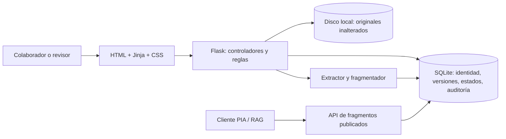
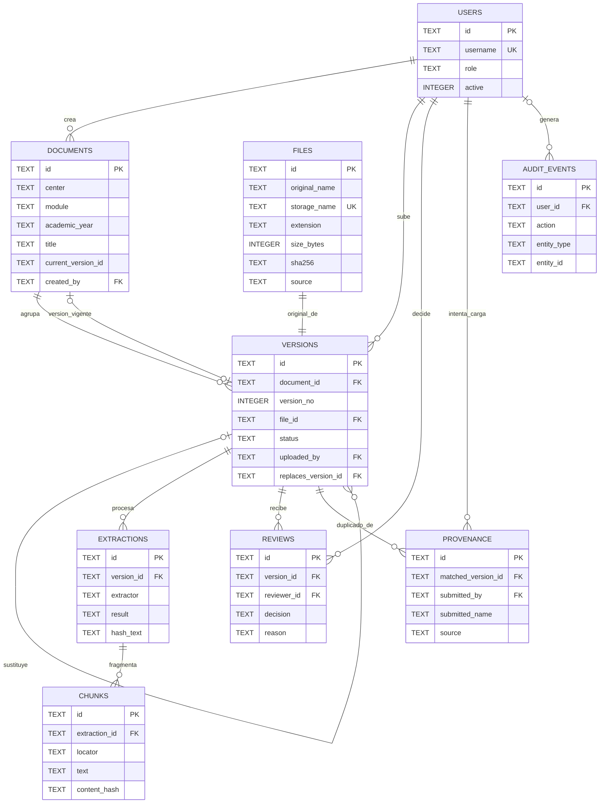

# Gestor de programaciones didácticas para DocIA+

Aplicación web local para incorporar programaciones, conservar cada original, revisar extracciones de texto y publicar de forma controlada la versión que podrá consultar un sistema RAG. El envío crea una versión pendiente; solo un revisor puede aprobarla, comprobar la extracción y publicarla. El prototipo no determina validez administrativa ni sustituye el procedimiento del centro.

## Qué incluye

- Inicio de sesión local con roles de colaborador, revisor y administrador.
- Alta de programaciones PDF, DOCX y TXT con metadatos de centro, módulo, curso académico, título, procedencia y estado declarado.
- Validación en servidor del tamaño y estructura básica del archivo, almacenamiento del original con nombre interno y cálculo de SHA-256.
- Detección de copia exacta. Si se repiten los mismos bytes, se registra la procedencia del intento y no se crea una extracción o versión duplicada.
- Aviso de posible actualización cuando coinciden centro, módulo y curso. El colaborador declara una relación propuesta y un revisor decide.
- Flujo de estados Pendiente → Aprobada → En preparación → Lista para publicar → Publicada. También permite devolver, rechazar, sustituir y retirar con motivo.
- Extracción inspeccionable: páginas PDF, párrafos/tablas DOCX o líneas TXT; fragmentación con localizador y huella de contenido.
- Publicación transaccional: al activar una nueva versión, la anterior pasa a histórica en la misma transacción SQLite.
- Separación de funciones: una persona no puede aprobar, verificar ni publicar su propia carga.
- Catálogo, filtros, descarga autenticada del original, historial de revisiones y auditoría de eventos relevantes.
- API de solo lectura para PIA, protegida con un token Bearer y limitada a fragmentos publicados y vigentes.
- Copia ZIP de la base de datos y los originales; restauración únicamente en una ubicación separada.

## Arquitectura elegida

La memoria de requisitos no imponía un proveedor concreto. Esta implementación usa **SQLite para el catálogo relacional y el almacenamiento local de archivos originales**. Con ello evita AWS S3 en esta versión y permite practicar claves, relaciones, consultas parametrizadas y transacciones sin un servicio externo. Es adecuada para un prototipo local de aula; no se presenta como despliegue de producción para varios centros.



### Tecnologías

- **Python 3.11 o 3.12:** lenguaje de la lógica de aplicación y herramientas de administración.
- **Flask:** rutas web, sesión de usuario, control de acceso y coordinación de los casos de uso.
- **Waitress:** servidor WSGI multiplataforma para ejecutar el prototipo desde los equipos del aula.
- **HTML, Jinja y CSS:** interfaz renderizada en servidor, plantillas accesibles y presentación adaptable.
- **SQLite:** base relacional incluida en Python, con claves foráneas, índices y transacciones.
- **pypdf y python-docx:** extracción de texto de PDF y DOCX; TXT se lee como UTF-8.
- **pytest:** pruebas de los flujos principales.

La estructura separa presentación, controladores, reglas y persistencia:

```text
app/
  __init__.py             creación y configuración de Flask
  auth.py                 inicio y cierre de sesión
  documents.py            rutas de catálogo, carga, ficha y revisión
  rag_api.py              contrato de consulta para PIA
  service.py              reglas de negocio y transacciones
  database.py             esquema SQLite y transacciones
  validation.py           validación de metadatos y cargas
  extraction.py           extracción y fragmentación
  templates/              vistas Jinja
  static/css/             estilos
scripts/
  init_project.py         genera secreto y crea el primer administrador
  create_user.py          crea cuentas con rol
  backup.py               copia base de datos y originales
  restore.py              restaura en carpeta nueva
tests/
```

## Modelo de almacenamiento

En `DATA_DIR` se guardan:

```text
instance/
  docia.sqlite3
  originales/
    <id-de-versión>/original.pdf
    <id-de-versión>/original.docx
    <id-de-versión>/original.txt
```

El nombre original se conserva como metadato visible. La ruta se genera con un identificador interno para que el nombre aportado por el usuario no controle la ubicación del archivo.

Las entidades principales de SQLite son:

- `documents`: identidad lógica única por centro, módulo y curso académico.
- `versions`: cada incorporación/versionado, su estado, quién la subió y revisó, relación con la versión sustituida y referencia al archivo original.
- `files`: metadatos técnicos del archivo (nombre original, ruta interna, formato, tamaño, SHA-256 y procedencia); los bytes permanecen en `originales/`.
- `extractions`: cada ejecución de extracción, su resultado/error, el texto normalizado y su hash. Reprocesar crea una extracción nueva y conserva la anterior.
- `chunks`: fragmentos asociados a una extracción concreta, con localizador y SHA-256 del contenido.
- `users`: cuentas locales con contraseña almacenada como hash y rol.
- `reviews`, `provenance` y `audit_events`: decisiones humanas, reintentos de copias exactas y eventos relevantes.

### Diagrama entidad-relación

El siguiente diagrama resume las tablas y las claves foráneas del esquema. `PK` identifica la clave primaria y `FK` una clave foránea.



Una programación (`documents`) puede tener varias versiones; cada versión apunta a un único archivo original (`file_id` también es `UNIQUE`, así que un archivo no se comparte entre versiones). Cada versión puede tener varias ejecuciones de extracción y cada extracción puede generar varios fragmentos. Las revisiones y los registros de procedencia conservan quién decidió o intentó cargar un duplicado. `audit_events.user_id` puede quedar vacío para eventos sin usuario asociado. `current_version_id` representa la versión vigente del documento, pero en el esquema actual es una referencia lógica sin restricción `FOREIGN KEY` declarada.

El original no se modifica durante la extracción. Documento lógico, versión, archivo, extracción y fragmentos se guardan por separado y se relacionan mediante claves foráneas. El texto y los fragmentos se conservan en SQLite para poder revisar la evidencia y consultar únicamente los fragmentos de la extracción más reciente de la versión vigente.

## Reglas de admisión y ciclo de vida

1. El colaborador completa los metadatos y selecciona un PDF, DOCX o TXT. Los campos obligatorios se validan en el navegador para ayudar y se vuelven a validar en el servidor.
2. El servidor comprueba extensión y firma/estructura básica, tamaño, lectura UTF-8 cuando corresponda y calcula SHA-256. La extensión sola no se considera prueba suficiente del formato.
3. Si ya existe el mismo SHA-256, la aplicación registra el intento como procedencia adicional y muestra la ficha existente; no duplica versiones ni fragmentos.
4. Si coincide centro + módulo + curso, la interfaz solicita indicar qué programación existente se relaciona y el motivo. Esa coincidencia es una posible actualización; no demuestra que ambos documentos deban fusionarse.
5. El original queda en estado **Pendiente**. Un revisor puede aprobarlo para procesar, devolverlo o rechazarlo con motivo. Un archivo declarado borrador no puede publicarse.
6. Tras aprobar, el revisor solicita la extracción. Si falla o no hay texto, se conserva el original y se informa del error; no se crean fragmentos publicables.
7. El revisor inspecciona la vista previa y confirma que la extracción es utilizable. Solo entonces la versión pasa a **Lista para publicar**.
8. Al publicar una revisión, una transacción SQLite activa la nueva y marca como sustituida la anterior. Un fallo en la operación deja la versión anterior vigente.
9. Retirar una versión la excluye de nuevas consultas, conservando el historial.

SHA-256 identifica coincidencia exacta de bytes; no cifra, no acredita autoría y no prueba aprobación oficial. Una coincidencia de identidad lógica o de texto requiere revisión humana.

## Roles

| Rol | Puede hacer |
| --- | --- |
| `collaborator` | Consultar el catálogo, adjuntar documentos y descargar originales |
| `reviewer` | Todo lo anterior y aprobar, devolver, rechazar, procesar, verificar, publicar o retirar. Si sube una versión, otra persona revisora debe aprobarla y publicarla. |
| `admin` | Todo lo anterior; gestionar cuentas mediante la herramienta local y las copias de seguridad |

El control se aplica en el servidor a cada operación, no solo ocultando botones. Las cuentas son locales al prototipo; no se conectan a Google, Microsoft ni al directorio institucional.

## Instalación y puesta en marcha

### macOS en Apple Silicon (M1/M2/M3/M4)

Esta aplicación funciona en macOS arm64. Requiere Python 3.11 o 3.12. En esta carpeta ya está preparado el entorno virtual `.venv` con Python 3.12.14 y las dependencias instaladas para este Mac. Para arrancarla, haz doble clic en `Iniciar_Gestor.command`. En el primer arranque se te pedirá crear el nombre y la contraseña de la cuenta administradora; después se abrirá el navegador en `http://127.0.0.1:5051/`. Deja abierta la ventana de Terminal mientras uses la aplicación y pulsa `Ctrl+C` para detenerla.

Si macOS impide abrir el archivo por ser una descarga, haz clic secundario en `Iniciar_Gestor.command` y elige **Abrir**. Si tras clonar o copiar el proyecto no existe `.venv`, instala Python 3.11/3.12 y sigue los comandos de macOS/Linux que aparecen a continuación. El entorno `.venv` es local y no debe copiarse a otro equipo.

### macOS o Linux

Desde la carpeta del proyecto:

```bash
cd Gestor_programaciones_profesor_v1
python3.11 -m venv .venv
source .venv/bin/activate
python -m pip install --upgrade pip
pip install -r requirements.txt
python scripts/init_project.py
```

`init_project.py` crea `.env` con una clave secreta aleatoria y solicita por consola el nombre y la contraseña de la primera cuenta administradora. La contraseña no se guarda en texto claro. A continuación crea el esquema SQLite.

Crea cuentas adicionales con contraseñas introducidas en la consola:

```bash
python scripts/create_user.py carlos --role reviewer
python scripts/create_user.py colaborador1 --role collaborator
```

Inicia la aplicación:

```bash
python run.py
```

Abre `http://127.0.0.1:5051/` en el mismo equipo. Para parar Waitress, pulsa `Ctrl+C` en la terminal.

### Windows PowerShell

```powershell
cd Gestor_programaciones_profesor_v1
py -3.11 -m venv .venv
.\.venv\Scripts\Activate.ps1
python -m pip install --upgrade pip
pip install -r requirements.txt
python scripts/init_project.py
python scripts/create_user.py revisor1 --role reviewer
python run.py
```

Si el sistema tiene Python 3.12, puede sustituirse `3.11` por `3.12`. El primer inicio requiere crear el administrador. No se incluyen cuentas ni contraseñas de demostración predefinidas.

## Configuración

El script inicial crea `.env`. Las variables principales son:

| Variable | Uso |
| --- | --- |
| `SECRET_KEY` | Firma de las sesiones Flask. La genera el instalador; no compartir ni subir a Git. |
| `DATA_DIR` | Directorio de la base SQLite y originales. Por defecto, `instance`. |
| `CENTER_NAME` | Nombre mostrado en la interfaz. |
| `MAX_FILE_MB` | Tamaño máximo de archivo. Por defecto, 20 MB. |
| `HOST` y `PORT` | Interfaz de escucha y puerto. Por defecto, `127.0.0.1:5051`. |
| `COOKIE_SECURE` | Activar solo si se sirve detrás de HTTPS. |
| `RAG_API_TOKEN` | Token Bearer opcional, necesario para consultar desde PIA. Configúralo con un secreto aleatorio. |

`127.0.0.1` mantiene el prototipo disponible solo desde el mismo ordenador. No cambies `HOST` a `0.0.0.0` en una red compartida sin añadir HTTPS, gestión de identidades y controles operativos adecuados.

## API para el módulo PIA

La ruta `GET /api/rag/chunks` devuelve fragmentos solo si el token configurado es correcto y se indican `module` y `academic_year`:

```http
GET /api/rag/chunks?module=SBD&academic_year=2026-27
Authorization: Bearer <RAG_API_TOKEN>
```

Cada resultado incluye `fragment_id`, `document_id`, `version_id`, `category`, `module`, `academic_year`, `source_uri`, `locator`, `text`, `publication_status`, `content_hash`, el título y la procedencia. El `source_uri` es un identificador lógico local, no una ruta que permita descargar archivos. El contrato nunca devuelve versiones pendientes, retiradas o sustituidas.

Para configurar el token, añade `RAG_API_TOKEN=<secreto-aleatorio>` a `.env` y reinicia el servidor. La interfaz del prototipo no expone este token.

## Copias y restauración de prueba

Crear una copia ZIP coherente de SQLite y de los originales:

```bash
python scripts/backup.py --output backups/prueba-docia.zip
```

Restaurarla en una ubicación nueva sin sobrescribir la instalación activa:

```bash
python scripts/restore.py backups/prueba-docia.zip --target /tmp/docia-restaurada
```

Si la ruta contiene espacios, escríbela entre comillas. En Windows, por ejemplo:

```powershell
python scripts/restore.py backups\prueba-docia.zip --target C:\DocIA\restauracion-prueba
```

Después, configura temporalmente `DATA_DIR` para que apunte al directorio restaurado y ejecuta la aplicación en un puerto distinto. La utilidad rechaza directorios destino no vacíos.

## Pruebas

```bash
pip install -r requirements-dev.txt
pytest
```

Las pruebas usan carpetas temporales y archivos sintéticos; no necesitan S3, credenciales AWS ni documentos reales del centro.

## Límites conocidos del prototipo

- SQLite y disco local son para el piloto local de aula; no hay réplica, almacenamiento distribuido ni alta disponibilidad.
- El extractor de PDF no hace OCR. Un PDF de imagen puede quedar sin texto y necesitar otra copia procesable o una herramienta OCR añadida después.
- Solo se procesa PDF, DOCX y TXT UTF-8; no se ejecutan macros ni contenido activo y no se admiten todos los formatos ofimáticos.
- Los localizadores DOCX/TXT son aproximados; en PDF se conserva el número de página que informa la librería.
- El proceso de extracción se ejecuta dentro de la petición web; archivos grandes o un volumen elevado requerirían una cola de trabajos.
- La relación de versión es revisada por una persona. El prototipo no decide validez oficial, contradicciones ni equivalencia semántica.
- No genera respuestas del RAG. Solo proporciona evidencia publicada con metadatos para que PIA la consuma.
- No incluir datos personales del alumnado. Usar documentos de práctica autorizados.
- No es un servicio público ni un gestor institucional listo para producción. La autenticación local y el secreto del RAG son apropiados para demostrar el flujo en entorno controlado, no sustituyen las cuentas institucionales ni una auditoría de despliegue.

## Relación con SBD, BDA y PIA

- **SBD:** identidad lógica, campos, estados, relaciones, trazabilidad, copias y recuperación.
- **BDA:** controles de entrada, hash, extracción, calidad observable, fragmentación y persistencia.
- **PIA:** contrato de recuperación, filtros por módulo y curso y uso de fragmentos publicados con localizadores.

Los criterios de aprobación, vigencia administrativa y publicación los confirma el profesorado o la persona institucional designada. El sistema enseña y aplica las reglas documentadas, pero no las inventa ni sustituye esa decisión.
