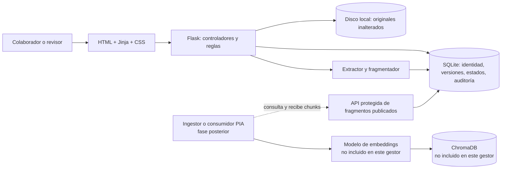
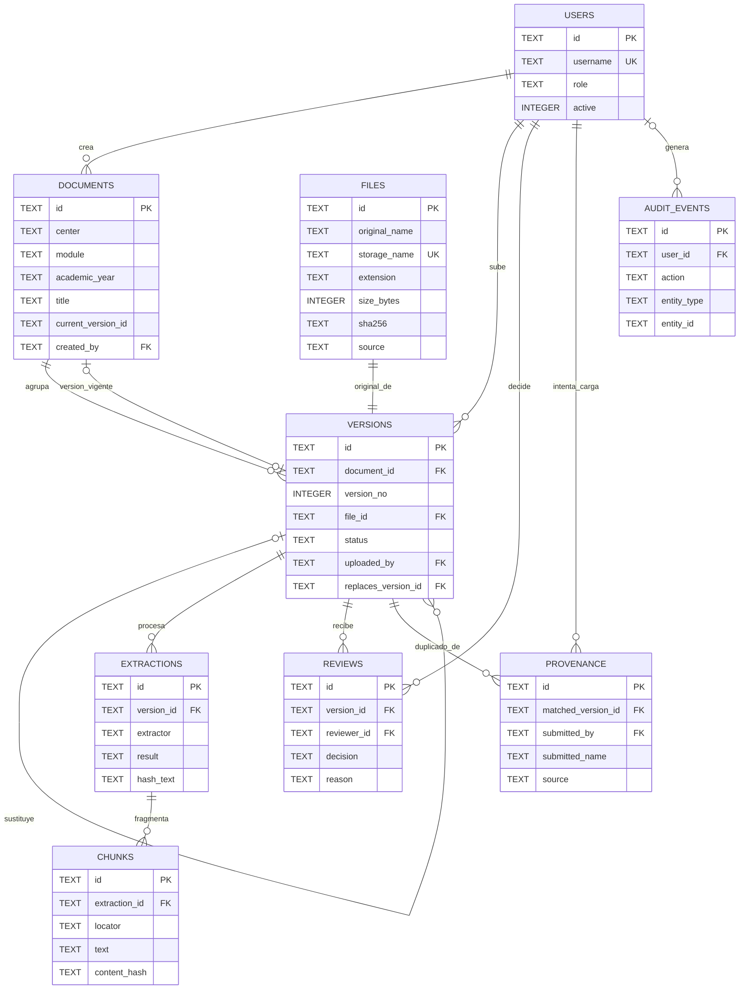

# Gestor de programaciones didácticas para DocIA+

Aplicación web local para incorporar programaciones, conservar cada original, revisar extracciones de texto y publicar de forma controlada la versión que podrá consultar un sistema RAG. El envío crea una versión pendiente; solo un revisor puede aprobarla, comprobar la extracción y publicarla. El prototipo no determina validez administrativa ni sustituye el procedimiento del centro.

## Qué hace la aplicación

El gestor lleva una programación desde la recepción del archivo hasta su disponibilidad como texto recuperable por el proyecto PIA. Conserva el original y la trazabilidad de cada decisión; la extracción y la publicación requieren revisión humana. El flujo completo se detalla más adelante, desde la carga hasta la entrega de fragmentos a PIA.

## Arquitectura elegida

La memoria de requisitos no imponía un proveedor concreto. Esta implementación usa **SQLite para el catálogo relacional y el almacenamiento local de archivos originales**. Con ello evita AWS S3 en esta versión y permite practicar claves, relaciones, consultas parametrizadas y transacciones sin un servicio externo. Es adecuada para un prototipo local de aula; no se presenta como despliegue de producción para varios centros.



### Tecnologías

- **Python 3.11 o 3.12:** lenguaje de la lógica de aplicación y herramientas de administración.
- **Flask:** rutas web, sesión de usuario, control de acceso y coordinación de los casos de uso.
- **Waitress:** servidor WSGI multiplataforma para ejecutar el prototipo desde los equipos del aula.
- **HTML, Jinja y CSS:** interfaz renderizada en servidor, plantillas accesibles y presentación adaptable.
- **SQLite:** base relacional incluida en Python, con claves foráneas, índices y transacciones.
- **pypdf y python-docx:** extracción de texto de PDF y DOCX; TXT se lee como UTF-8.
- **pytest:** pruebas de los flujos principales.

La estructura separa presentación, controladores, reglas y persistencia:

```text
app/
  __init__.py             creación y configuración de Flask
  auth.py                 inicio y cierre de sesión
  documents.py            rutas de catálogo, carga, ficha y revisión
  rag_api.py              contrato de consulta para PIA
  service.py              reglas de negocio y transacciones
  database.py             esquema SQLite y transacciones
  validation.py           validación de metadatos y cargas
  extraction.py           extracción y fragmentación
  templates/              vistas Jinja
  static/css/             estilos
scripts/
  init_project.py         genera secreto y crea el primer administrador
  create_user.py          crea cuentas con rol
  backup.py               copia base de datos y originales
  restore.py              restaura en carpeta nueva
tests/
```

## Modelo de almacenamiento

En `DATA_DIR` se guardan:

```text
instance/
  docia.sqlite3
  originales/
    <id-de-versión>/original.pdf
    <id-de-versión>/original.docx
    <id-de-versión>/original.txt
```

El nombre original se conserva como metadato visible. La ruta se genera con un identificador interno para que el nombre aportado por el usuario no controle la ubicación del archivo.

Las entidades principales de SQLite son:

- `documents`: identidad lógica única por centro, módulo y curso académico.
- `versions`: cada incorporación/versionado, su estado, quién la subió y revisó, relación con la versión sustituida y referencia al archivo original.
- `files`: metadatos técnicos del archivo (nombre original, ruta interna, formato, tamaño, SHA-256 y procedencia); los bytes permanecen en `originales/`.
- `extractions`: cada ejecución de extracción, su resultado/error, el texto normalizado y su hash. Reprocesar crea una extracción nueva y conserva la anterior.
- `chunks`: fragmentos asociados a una extracción concreta, con localizador y SHA-256 del contenido.
- `users`: cuentas locales con contraseña almacenada como hash y rol.
- `reviews`, `provenance` y `audit_events`: decisiones humanas, reintentos de copias exactas y eventos relevantes.

### Diagrama entidad-relación

El siguiente diagrama resume las tablas y las claves foráneas del esquema. `PK` identifica la clave primaria y `FK` una clave foránea.



Una programación (`documents`) puede tener varias versiones; cada versión apunta a un único archivo original (`file_id` también es `UNIQUE`, así que un archivo no se comparte entre versiones). Cada versión puede tener varias ejecuciones de extracción y cada extracción puede generar varios fragmentos. Las revisiones y los registros de procedencia conservan quién decidió o intentó cargar un duplicado. `audit_events.user_id` puede quedar vacío para eventos sin usuario asociado. `current_version_id` representa la versión vigente del documento, pero en el esquema actual es una referencia lógica sin restricción `FOREIGN KEY` declarada.

El original no se modifica durante la extracción. Documento lógico, versión, archivo, extracción y fragmentos se guardan por separado y se relacionan mediante claves foráneas. El texto y los fragmentos se conservan en SQLite para poder revisar la evidencia y consultar únicamente los fragmentos de la extracción más reciente de la versión vigente.

## Flujo de trabajo: del original al corpus disponible

### 1. Recepción, metadatos y validación

El colaborador adjunta un PDF, DOCX o TXT y completa centro, módulo, curso académico, título, procedencia y estado declarado. La interfaz hace comprobaciones básicas para ayudar, y el servidor vuelve a validar los datos, el tamaño máximo de 20 MB y la firma o estructura esperada del archivo. Para TXT también comprueba que el contenido sea UTF-8. El archivo se conserva sin modificar, con una ruta interna generada por el sistema; su nombre original y su SHA-256 quedan en la ficha.

El SHA-256 sirve para detectar una copia exacta de los mismos bytes. Si coincide con un archivo ya cargado, el gestor registra quién volvió a presentarlo y su procedencia, y muestra la ficha existente en lugar de crear otra versión. Si ya existe una programación para el mismo centro, módulo y curso, el gestor lo presenta como posible relación: el colaborador debe proponer si es una revisión, un complemento o una relación todavía no determinada, y explicar el motivo. Esa coincidencia no decide automáticamente que los documentos sean equivalentes.

### 2. Extracción de texto y creación de chunks

Después de la aprobación inicial de un revisor, el sistema extrae texto del original. El original permanece intacto. Cada ejecución queda registrada en `extractions` con el extractor, el resultado, el posible error, el texto normalizado y su huella SHA-256. Si la lectura falla o no se obtiene texto —por ejemplo, en un PDF escaneado sin capa de texto— se conserva el archivo original, se muestra el error y no se ofrecen fragmentos publicables.

La lectura depende del formato:

- **PDF:** extrae el texto página a página con pypdf y conserva el número de página como localizador.
- **DOCX:** reúne el texto de los párrafos y las tablas en un bloque con localizador `documento`.
- **TXT:** lee UTF-8 y organiza el contenido en bloques de hasta 80 líneas, indicando el rango de líneas.

Antes de fragmentar, elimina caracteres nulos, reduce secuencias de espacios y tabuladores, y limita los saltos de línea repetidos. Después aplica una fragmentación sencilla, de tamaño fijo por caracteres:

- Tamaño máximo por chunk: **1.000 caracteres**.
- Solapamiento entre chunks consecutivos: **150 caracteres**.
- El siguiente bloque empieza 850 caracteres después del anterior. Por ejemplo, el primero abarca los caracteres 1–1.000 y el segundo empieza en el 851.
- La fragmentación se hace dentro de cada página PDF o bloque TXT; no cruza esos límites. DOCX se trata como un único bloque.
- Cada chunk guarda el localizador de origen y un SHA-256 de su texto. Si excede el tamaño, el localizador incluye también el rango aproximado de caracteres.

El tamaño se mide en **caracteres, no en tokens**, y los cortes no intentan detectar frases, apartados ni encabezados. Es una estrategia básica y transparente para el prototipo; puede separar una idea entre dos chunks. El solapamiento ayuda a conservar contexto en los bordes, aunque repite parte del texto. Los chunks se guardan en SQLite y quedan vinculados a una extracción concreta, por lo que las ejecuciones anteriores se conservan para trazabilidad.

### 3. Revisión y publicación humana

La versión recorre los estados **Pendiente → Aprobada → En preparación → Lista para publicar → Publicada**. Un revisor distinto de quien subió el archivo aprueba la carga, inspecciona la extracción y confirma si el texto sirve como evidencia. Puede devolverla o rechazarla con un motivo. Una programación declarada como borrador no se puede publicar.

Al publicar una nueva revisión, una transacción SQLite activa la nueva versión y marca la anterior como sustituida; así no se exponen simultáneamente ambas como vigentes. Retirar una versión la excluye de futuras consultas y conserva el historial. El sistema registra las decisiones y eventos relevantes.

### 4. Entrega de fragmentos a PIA

La ruta protegida `GET /api/rag/chunks` entrega a PIA únicamente chunks de una versión publicada y vigente cuya extracción más reciente haya terminado correctamente. La consulta requiere el token Bearer configurado y filtra por módulo y curso académico; también admite centro como filtro opcional. Cada resultado incluye identificadores de fragmento, documento y versión, categoría, módulo, curso, localizador, texto, huella del chunk, estado de publicación, título, nombre original y procedencia. Aunque se puede filtrar por centro, el campo `center` todavía no se incluye en cada resultado. `source_uri` es un identificador lógico local, no un enlace de descarga.

Esta API sirve el texto y sus metadatos para el siguiente componente. **El gestor no calcula embeddings, no persiste vectores y no escribe en ChromaDB**; esas tareas corresponderían al proceso de ingesta/recuperación de PIA. Al sincronizar una versión nueva, ese proceso tendría que sustituir o retirar de su índice los vectores asociados a versiones antiguas.

SHA-256 identifica coincidencia exacta de bytes o texto; no cifra, no acredita autoría y no prueba aprobación oficial. Una coincidencia de identidad lógica o la equivalencia semántica de dos documentos requiere revisión humana.

## Roles

| Rol | Puede hacer |
| --- | --- |
| `collaborator` | Consultar el catálogo, adjuntar documentos y descargar originales |
| `reviewer` | Todo lo anterior y aprobar, devolver, rechazar, procesar, verificar, publicar o retirar. Si sube una versión, otra persona revisora debe aprobarla y publicarla. |
| `admin` | Todo lo anterior; gestionar cuentas mediante la herramienta local y las copias de seguridad |

El control se aplica en el servidor a cada operación, no solo ocultando botones. Las cuentas son locales al prototipo; no se conectan a Google, Microsoft ni al directorio institucional.

## Instalación y puesta en marcha

### macOS en Apple Silicon (M1/M2/M3/M4)

Esta aplicación funciona en macOS arm64. Requiere Python 3.11 o 3.12. En esta carpeta ya está preparado el entorno virtual `.venv` con Python 3.12.14 y las dependencias instaladas para este Mac. Para arrancarla, haz doble clic en `Iniciar_Gestor.command`. En el primer arranque se te pedirá crear el nombre y la contraseña de la cuenta administradora; después se abrirá el navegador en `http://127.0.0.1:5051/`. Deja abierta la ventana de Terminal mientras uses la aplicación y pulsa `Ctrl+C` para detenerla.

Si macOS impide abrir el archivo por ser una descarga, haz clic secundario en `Iniciar_Gestor.command` y elige **Abrir**. Si tras clonar o copiar el proyecto no existe `.venv`, instala Python 3.11/3.12 y sigue los comandos de macOS/Linux que aparecen a continuación. El entorno `.venv` es local y no debe copiarse a otro equipo.

### macOS o Linux

Desde la carpeta del proyecto:

```bash
cd Gestor_programaciones_profesor_v1
python3.11 -m venv .venv
source .venv/bin/activate
python -m pip install --upgrade pip
pip install -r requirements.txt
python scripts/init_project.py
```

`init_project.py` crea `.env` con una clave secreta aleatoria y solicita por consola el nombre y la contraseña de la primera cuenta administradora. La contraseña no se guarda en texto claro. A continuación crea el esquema SQLite.

Crea cuentas adicionales con contraseñas introducidas en la consola:

```bash
python scripts/create_user.py carlos --role reviewer
python scripts/create_user.py colaborador1 --role collaborator
```

Inicia la aplicación:

```bash
python run.py
```

Abre `http://127.0.0.1:5051/` en el mismo equipo. Para parar Waitress, pulsa `Ctrl+C` en la terminal.

### Windows PowerShell

```powershell
cd Gestor_programaciones_profesor_v1
py -3.11 -m venv .venv
.\.venv\Scripts\Activate.ps1
python -m pip install --upgrade pip
pip install -r requirements.txt
python scripts/init_project.py
python scripts/create_user.py revisor1 --role reviewer
python run.py
```

Si el sistema tiene Python 3.12, puede sustituirse `3.11` por `3.12`. El primer inicio requiere crear el administrador. No se incluyen cuentas ni contraseñas de demostración predefinidas.

## Configuración

El script inicial crea `.env`. Las variables principales son:

| Variable | Uso |
| --- | --- |
| `SECRET_KEY` | Firma de las sesiones Flask. La genera el instalador; no compartir ni subir a Git. |
| `DATA_DIR` | Directorio de la base SQLite y originales. Por defecto, `instance`. |
| `CENTER_NAME` | Nombre mostrado en la interfaz. |
| `MAX_FILE_MB` | Tamaño máximo de archivo. Por defecto, 20 MB. |
| `HOST` y `PORT` | Interfaz de escucha y puerto. Por defecto, `127.0.0.1:5051`. |
| `COOKIE_SECURE` | Activar solo si se sirve detrás de HTTPS. |
| `RAG_API_TOKEN` | Token Bearer opcional, necesario para consultar desde PIA. Configúralo con un secreto aleatorio. |

`127.0.0.1` mantiene el prototipo disponible solo desde el mismo ordenador. No cambies `HOST` a `0.0.0.0` en una red compartida sin añadir HTTPS, gestión de identidades y controles operativos adecuados.

## API para el módulo PIA

La ruta `GET /api/rag/chunks` devuelve fragmentos solo si el token configurado es correcto y se indican `module` y `academic_year`:

```http
GET /api/rag/chunks?module=SBD&academic_year=2026-27
Authorization: Bearer <RAG_API_TOKEN>
```

La respuesta es JSON con `items`, `count` y `scope`; el contenido de cada elemento y sus restricciones de vigencia se describen en el paso 4 del flujo de trabajo. Puede añadirse `center=IES%20Ataulfo%20Argenta` como filtro opcional. La ruta responde con `503` si falta configurar el token, `401` si el token enviado no coincide y `400` si falta módulo o curso académico.

Para configurar el token, añade `RAG_API_TOKEN=<secreto-aleatorio>` a `.env` y reinicia el servidor. La interfaz del prototipo no expone este token.

## Copias y restauración de prueba

Crear una copia ZIP coherente de SQLite y de los originales:

```bash
python scripts/backup.py --output backups/prueba-docia.zip
```

Restaurarla en una ubicación nueva sin sobrescribir la instalación activa:

```bash
python scripts/restore.py backups/prueba-docia.zip --target /tmp/docia-restaurada
```

Si la ruta contiene espacios, escríbela entre comillas. En Windows, por ejemplo:

```powershell
python scripts/restore.py backups\prueba-docia.zip --target C:\DocIA\restauracion-prueba
```

Después, configura temporalmente `DATA_DIR` para que apunte al directorio restaurado y ejecuta la aplicación en un puerto distinto. La utilidad rechaza directorios destino no vacíos.

## Pruebas

```bash
pip install -r requirements-dev.txt
pytest
```

Las pruebas usan carpetas temporales y archivos sintéticos; no necesitan S3, credenciales AWS ni documentos reales del centro.

## Límites conocidos del prototipo

- SQLite y disco local son para el piloto local de aula; no hay réplica, almacenamiento distribuido ni alta disponibilidad.
- El extractor de PDF no hace OCR. Un PDF de imagen puede quedar sin texto y necesitar otra copia procesable o una herramienta OCR añadida después.
- Solo se procesa PDF, DOCX y TXT UTF-8; no se ejecutan macros ni contenido activo y no se admiten todos los formatos ofimáticos.
- Los localizadores DOCX/TXT son aproximados; en PDF se conserva el número de página que informa la librería.
- El proceso de extracción se ejecuta dentro de la petición web; archivos grandes o un volumen elevado requerirían una cola de trabajos.
- La relación de versión es revisada por una persona. El prototipo no decide validez oficial, contradicciones ni equivalencia semántica.
- No genera respuestas del RAG. Solo proporciona evidencia publicada con metadatos para que PIA la consuma.
- No incluir datos personales del alumnado. Usar documentos de práctica autorizados.
- No es un servicio público ni un gestor institucional listo para producción. La autenticación local y el secreto del RAG son apropiados para demostrar el flujo en entorno controlado, no sustituyen las cuentas institucionales ni una auditoría de despliegue.

## Relación con SBD, BDA y PIA

- **SBD:** identidad lógica, campos, estados, relaciones, trazabilidad, copias y recuperación.
- **BDA:** controles de entrada, hash, extracción, calidad observable, fragmentación y persistencia.
- **PIA:** contrato de recuperación, filtros por módulo y curso y uso de fragmentos publicados con localizadores.

Los criterios de aprobación, vigencia administrativa y publicación los confirma el profesorado o la persona institucional designada. El sistema enseña y aplica las reglas documentadas, pero no las inventa ni sustituye esa decisión.
